# Architecture

## Goal

This project is a Nintendo DS backend for the Super Smash Bros. 64
decompilation in `decomp/BattleShip-main/decomp`. The rest of `decomp/` is also
read-only reference material and useful context: BattleShip docs/tools/assets explain the source
and data formats, while `decomp/sm64-nds` shows a working N64-decomp-to-DS
architecture. The goal is not to write a new Smash-like engine. The target
architecture is:

```text
Original BattleShip Smash 64 game code
+ Nintendo DS platform/backend compatibility layer
= progressively playable Smash 64 DS port
```

`decomp/sm64-nds` is the architecture reference for how an N64 decompilation can
be hosted on Nintendo DS hardware. It is not a gameplay source and should not be
copied as a replacement engine.

## Definition Of 1:1

For this project, "1:1" means original BattleShip/Super Smash Bros. 64 game
code remains the source of truth for behavior, scene flow, object/task logic,
menus, fighters, stages, items, collision, camera, animation, hitboxes,
physics, and game rules.

Nintendo DS code replaces platform/backend systems only. It should not
hand-author gameplay, approximate moves, recreate menus, or replace original
systems when the BattleShip source can be ported through compatibility shims.

## Source Ownership

BattleShip source remains the source of truth for gameplay and game state:

- fighter logic
- animation state logic
- hitboxes and hurtboxes
- collision
- item and stage behavior
- menu and scene transitions
- camera behavior
- physics and knockback formulas

Nintendo DS code owns only platform behavior:

- entry point and frame loop
- libultra OS compatibility
- controller input backend
- video, display-list, and texture backend
- audio backend
- ROM/filesystem asset loading
- memory allocation
- overlays and relocation behavior
- save data
- timing and VBlank integration

## Directory Roles

- `src/import`: small wrapper files that include original BattleShip `.c`
  translation units. Add to this directory when importing another original
  subsystem.
- `src/nds`: libnds entry point and DS hardware integration.
- `src/port`: compatibility backend, diagnostics, temporary stubs, and
  architecture probes.
- `include`: DS-port compatibility headers. These intentionally shadow only the
  narrow ABI needed by imported BattleShip source.
- `include/PR`: libultra-compatible surface used by imported source.
- `decomp`: read-only upstream reference tree. See `docs/DECOMP_MAP.md`.
- `decomp/BattleShip-main/decomp`: original Smash 64 decomp source.
- `decomp/BattleShip-main/docs`, `tools`, `debug_tools`, and `BattleShip_o2r`:
  source/data-format context used before making port decisions.
- `decomp/sm64-nds`: reference for DS architecture only.

Treat both `decomp/` repositories as read-only upstream checkouts. Port hooks
belong in project-owned wrappers under `src/import`, compatibility code under
`src/port` or `src/nds`, and declarations under `include/`.

`src/port/scene_backend.c` is now a thin mechanical include orchestrator over
DS-owned backend slices: `diagnostics.c`, `taskman_seam.c`,
`reloc_backend.c`, `sprite_preview_backend.c`, `opening_movie_backend.c`, and
`title_backend.c`. Those slices are included by `scene_backend.c` to preserve
the previous static linkage exactly. Do not add them to `Makefile` `CFILES`
until a separate ABI cleanup introduces explicit narrow headers for shared
symbols.

The dev/test scene harness is separate from the runtime scene backend. It lives
in `src/port/scene_harness.c`, is declared by
`include/nds/nds_scene_harness.h`, and is applied by the project-owned wrapper
around imported `scManagerRunLoop`. It pre-seeds
`dSCManagerDefaultSceneData` before BattleShip's scene manager copies defaults,
so direct boundary tests still dispatch through original scene-manager logic.
Default builds use `NDS_DEV_SCENE_HARNESS=normal`; non-normal harness builds
must remain development/verifier targets only.

Generated build outputs belong in `build/` and root `smash64ds.*` artifacts.
Do not edit generated output directories.

## Include Strategy

The Makefile does not add `BattleShip-main/decomp/include` globally because
BattleShip's N64 libc headers can shadow host/devkit headers such as
`stddef.h`, `string.h`, and related C library interfaces.

Instead, the port exposes a narrow compatibility ABI through `include/`.
When an imported BattleShip source needs another N64 type or function:

1. Inspect the original BattleShip header and source.
2. Add the minimum compatible declaration to a DS shadow header.
3. Put behavior in `src/port`, not in the imported source.
4. Prefer a clear diagnostic stub over a guessed rewrite.
5. Document whether the symbol is implemented, stubbed, or deferred.

This keeps original game code compiling while making every backend substitution
visible.

## Boot Flow

Current verified flow:

```mermaid
flowchart TD
    A["src/nds/main.c"] --> B["syMainLoop (BattleShip sys/main.c)"]
    B --> C["syMainThread1Idle"]
    C --> D["syMainThread5"]
    D --> E["original scheduler thread"]
    D --> F["original controller thread"]
    D --> G["audio service stub"]
    D --> H["scManagerRunLoop (BattleShip scmanager.c)"]
    H --> I["US default scene kind 27"]
    I --> J["mnStartupStartScene (BattleShip mnstartup.c)"]
    J --> K["syVideoInit (BattleShip video.c)"]
    J --> L["syTaskmanStartTask (BattleShip taskman.c)"]
    L --> M["gcSetupObjman (BattleShip objman.c)"]
    M --> N["syTaskmanLoadScene (BattleShip taskman.c)"]
    N --> O["mnStartupFuncStart (BattleShip mnstartup.c)"]
    O --> P["syTaskmanRunTask DS seam"]
    P --> Q["bounded startup scene_draw at update 17"]
    Q --> R["lbCommonDrawSprite -> gcCaptureCameraGObj -> lbCommonDrawSObjAttr"]
    R --> S["DS preview renders original N64Logo Sprite"]
    S --> T["55 task_update calls -> gcRunAll"]
    T --> U["original startup requests Opening Room"]
    U --> V["taskman load-scene break/eject"]
    V --> W["original taskman cleanup tail"]
    W --> X["return to scManagerRunLoop"]
    X --> OA["dispatch mvOpeningRoomStartScene"]
    OA --> OB["Opening Room syTaskmanStartTask"]
    OB --> OC["mvOpeningRoomFuncStart: relocation list + O2R payloads + actor/cameras/setup objects"]
    OC --> OD["DS probe resolves first tick-280 pencils and logo asset references"]
    OD --> OE["DS probe validates pencils descriptor/table shape"]
    OE --> OF["gcRunAll -> mvOpeningRoomFuncRun: ticks 1-560"]
    OF --> OG["tick 280: defer fighter creation only"]
    OG --> OH["original mvOpeningRoomMakePencils from update callback"]
    OH --> OI["real GObj/DObj/XObj/process/display-link creation"]
    OI --> OJ["original gcEjectGObj removes logo, overlay, and boss-shadow GObjs"]
    OJ --> OK["tick 380: defer pulled-fighter status/rotation"]
    OK --> OL["tick 450: original mvOpeningRoomMakeCloseUpOverlay"]
    OL --> OM["real close-up overlay GObj/display-link creation"]
    OM --> ON["tick 450: eject real sunlight GObj"]
    ON --> OO["tick 500: defer pulled-fighter display-link move"]
    OO --> OP["tick 500: original mvOpeningRoomMakeSpotlight"]
    OP --> OQ["real spotlight GObj/DObj/XObj/MObj/process/display-link/matanim/position setup"]
    OQ --> ORN["tick 560: original Scene 1 camera ejection"]
    ORN --> OS["tick 560: original mvOpeningRoomMakeScene2Cameras"]
    OS --> OT["defer Boss fighter status"]
    OT --> OU["original controller checks on ticks 10-560"]
    OU --> OV["bounded Opening Room scene_draw -> gcDrawAll"]
    OV --> OX["func_80017EC0 -> gcCaptureCameraGObj"]
    OX --> OY["gcDrawDObjDLLinksForGObj on display link 6"]
    OY --> OZ["narrow DS DL preview samples DObj/XObj transform and renders first DObj slice"]
    OU -. "A/B/Start" .-> OW["original load-scene break -> Title"]
```



The current opening-movie boundary now extends beyond this older renderer
diagram: imported Opening Room runs bounded updates through tick `1320`, requests
`nSCKindOpeningPortraits`, imported `mvopeningportraits.c` starts through the
same scene-manager/taskman architecture, loads the original Set1/Set2 portrait
O2Rs through the DS relocation layer, renders original portrait-card SObjs
through the bounded DS Sprite preview path, then hands off to Opening Mario and
the imported Donkey/Link/Samus/Yoshi/Kirby/Fox/Pikachu name-card scenes. The
fighter/stage-heavy action scenes from `OpeningRun` through `OpeningNewcomers`
are currently bridged in original scene order. Title then dispatches through
imported `mntitle.c` / `mntitlefiles.c`, loads the original `MNTitle` and
`MNTitleFireAnim` O2R resources, creates the original bounded Title actor and
camera setup, calls original `efParticleInitAll` and `mnTitleMakeLogoFire` to
create the logo-fire GObj/display-link boundary, initializes Title vars, calls
original `mnTitleMakeFire` to create the fire GObj/SObj/process/display
boundary, normalizes the 30 original `MNTitleFireAnim` frame sprites, explicitly
defers the remaining logo/label/slash/logo-fire-particle branches, runs one
guarded original Title update tick on the natural
`OpeningNewcomers -> Title` path, and composites a bounded
original sprite preview. None of these movie/title visuals are DS-native
replacement art.

The current menu-to-battle spine is also original-code first. Imported
`mnvsmode.c`, `mnplayersvs.c`, and `mnmaps.c` can run as bounded setup or
transition harnesses, preserving the VS Start, PlayersVS ready/start, and Maps
A-select transitions through original controller/state paths. The chain now
continues into imported `sccommon/scvsbattle.c` and
`sccommon/scvsbattlefiles.c` for a bounded VSBattle setup proof: common battle
files are loaded through the DS relocation layer, battle camera/interface/
manager calls reach project-owned compatibility stubs, active fighter
descriptors are built from `SCBattleState`, setup-only harnesses create stub
fighter GObjs, and the Mario/Fox model harnesses replace those stubs with
bounded asset-backed fighter GObjs that own real top/model/commonpart DObj
trees. The Mario/Fox struct harnesses attach persistent project-owned
`FTStruct` shells to those real fighter GObjs, keep `ftGetStruct` pointer
identity stable, and prove a bounded top/common joint table from the DObj tree.
The Mario/Fox init harnesses then run a bounded project-owned helper in the
same source order as the safe initialization portion of original
`ftManagerInitFighter`, seeding damage, shield, velocities, root DObj
transform, collision contracts, floor projection, passive vars, and guarded
compatibility-call diagnostics for Mario and Fox.
The current fighter spine continues through imported original Wait, Walk,
Dash, Run, RunBrake, KneeBend, Jump, Fall, and Landing slices. The direct and
menu-chain process-loop harnesses first prove those paths in a bounded
source-order frame driver. The direct and menu-chain scheduler-loop harnesses
then attach selected Mario/Fox `GObjProcess` callbacks with original
`gcAddGObjProcess`, invoke them through `gcRunGObjProcess`, and run the same
movement contract from the wrapped `scVSBattleFuncUpdate` path under a capped
VSBattle taskman update loop. The current draw spine reaches original
`gcDrawAll()` for bounded moving Mario/Fox keyframes and now includes selected
Pupupu display-layer/map GObjs in the same camera-capture traversal, proving
their imported stage display callbacks reach the DS-owned DObj draw bridges.
One bounded `scVSBattleFuncUpdate` interface tick is verified before parking.
This is not full battle gameplay; exact original fighter joint-ID mapping, full
`gcRunAll` object-process scheduling, real fighter input/update/physics loops,
unmasked full-scene `gcDrawAll`, hardware polygon rendering, stage runtime,
item/weapon runtime, full interface rendering, results, and audio playback
remain deferred until their own narrow original-source boundaries are imported.

The bounded renderer boundary for DObj display lists remains after Opening Room
draw/preview probes that follow the tick-560 Scene 2 camera transition event in imported
`mv/mvopening/mvopeningroom.c`. Before the startup scene exits, the DS seam now
runs one bounded original draw pass at startup update `17`, through
`mnStartupFuncDraw -> gcDrawAll -> lbCommonDrawSprite ->
gcCaptureCameraGObj -> lbCommonDrawSObjAttr`, and renders the original
`N64Logo` Sprite as a DS preview buffer. The startup scene reaches
BattleShip's own `syTaskmanStartTask`, which initializes the real general heap,
object manager, display-list buffers, graphics heaps, RDP buffer state,
controller auto-read state, and startup callbacks. The DS taskman seam lets 55
`task_update` calls run through `syTaskmanCommonTaskUpdate` and `gcRunAll`,
proves the startup logo coroutine sets its proceed-opening flag, lets
`mnStartupActorFuncRun` request `nSCKindOpeningRoom`, mirrors the original
taskman cleanup tail, and returns to `scManagerRunLoop`. Opening Room then runs
its original entry/task path, runs `lbRelocInitSetup` and
`lbRelocLoadFilesListed` for the eight original Opening Room file IDs through a
DS manifest, validates and copies the eight real BattleShip O2R payloads from
NitroFS into the original task heap, loads the startup `N64Logo` O2R payload
from NitroFS, applies the blanket `u32` endian pass,
patches their internal relocation pointer chains, probes selected BattleShip
`ll...` symbol offsets, proves the two `MVCommon` pointers needed by the first
tick-280 pencils event resolve, validates the resolved `DObjDesc[4]`,
display-list pointer count, animation table count, and first animation opcode,
then calls original `mvOpeningRoomMakeScene1Cameras` during setup. That Scene
1 path creates two camera GObjs, two CObjs, four XObjs, two parked
`func_80017EC0` display callback links, two original `gcPlayCamAnim` process
links, two camanim joint attachments, original viewport values, and DL-buffer
flags. Setup then calls original `mvOpeningRoomMakeCloseUpOverlayCamera`,
creating one camera GObj, one CObj, the parked `lbCommonDrawSprite` display
callback, original viewport values, and no default XObjs. Setup then calls
original `mvOpeningRoomMakeWallpaperCamera`. That
camera path creates one camera GObj, one CObj, the parked
`lbCommonDrawSprite` display callback, original viewport values, and no
default XObjs. Setup also calls original `mvOpeningRoomMakeLogoCamera`. That camera
path creates one real camera GObj, one CObj, two XObjs, the parked
`func_80017EC0` display callback, the original `gcPlayCamAnim` process, the
camanim joint attachment, and the original viewport values. The setup also
calls original `mvOpeningRoomMakeLogo`; that logo path creates one real GObj,
two DObjs, four XObjs, one MObj, a parked display callback link, and a material
animation attachment. The project-owned Opening Room wrapper creates the real
Outside object from the original `llMVCommonRoomOutsideDisplayList` reference
at offset `147968`: one GObj, one DObj, one XObj, and the original
`gcDrawDObjDLLinksForGObj` display callback on display link 6. It then creates
the real Haze object from the original `llMVCommonRoomHazeDisplayList`
reference at offset `39160`: one GObj, one DObj, one XObj, and the original
`gcDrawDObjDLLinksForGObj` display callback on display link 6. It then
creates the real sunlight object from the original
`llMVCommonRoomSunlightDisplayList` reference at offset `149256`: one GObj,
one DObj, one XObj, and the original
`gcDrawDObjDLLinksForGObj` display callback on display link 6. The tick-280 update
callback records fighter creation as the only deferred first-event portion,
then calls original `mvOpeningRoomMakePencils` from inside
`mvOpeningRoomFuncRun`. That path uses imported `sys/objanim.c` and
`sys/interp.c` to build one real GObj, three DObjs, six XObjs, one process
link, one parked display callback link, a three-node DObj tree, and one
animation root. The same update calls original `gcEjectGObj` on the logo GObj,
the logo-wallpaper overlay GObj created during Opening Room setup, and the
boss-shadow GObj created through original `mvOpeningRoomMakeBossShadow`,
proving all three pointers leave original common and display-link lists.
Opening Room then continues through tick 380, explicitly records the original
fighter-status/rotation branch as deferred because the pulled fighter is still
guarded, reaches tick 450, calls original `mvOpeningRoomMakeCloseUpOverlay`,
and proves that path creates one real GObj with the original display callback
on display link 26 and overlay alpha initialized to `0`. The same tick ejects
the real sunlight GObj through original `gcEjectGObj` and verifies common and
display-link unlinking; no tick-450 branch remains deferred. Opening Room now
continues to tick 500, records the pulled
fighter display-link move as explicitly deferred because fighter creation
remains guarded, and calls original `mvOpeningRoomMakeSpotlight`. That path
resolves the spotlight display-list, MObj, and material-animation assets from
`MVCommon` offsets `142872`, `142480`, and `143120`; creates one GObj, one
DObj, one XObj, two MObjs, a `gcDrawDObjDLHead1` display callback on display
link 27, a `gcPlayAnimAll` process, a material-animation attachment, and the
original fighter-kind-dependent spotlight position.
Opening Room then continues to tick 560, calls original
`mvOpeningRoomEjectCameraGObjs`, proves the previous Scene 1 cameras are
unlinked and two CObjs return to the camera pool, then calls original
`mvOpeningRoomMakeScene2Cameras`. That path resolves the Scene 2 camanim symbol
from `MVOpeningRoomScene2` offset `0`, creates two Scene 2 camera GObjs, two
CObjs, four XObjs, two `func_80017EC0` display callbacks, two
`gcPlayCamAnim` processes, two camanim attachments, original viewport values,
and DL-buffer flags. The same tick records the Boss fighter status call as
explicitly deferred because Boss fighter creation remains guarded.
The DS seam then runs one bounded Opening Room `scene_draw` call. That path
enters original `gcDrawAll`, executes the original `func_80017EC0` camera
callbacks through a narrow DS `gcCaptureCameraGObj` bridge, and reaches an
original `gcDrawDObjDLLinksForGObj` DObj callback on display link 6. The draw
probe records `ORDW`, blocker `3`, three camera callbacks, six display
callbacks, five DObj callbacks, first camera mask `0x40`, first camera
priority `80`, first captured object link `6`, first object kind `1`, callback
`0x444C4E4B`, a nonzero DObj display-list pointer, and DObj meta `0x11`. The
DS backend first records that fallback first-list path, but the visible bounded
preview now prefers the first material-bearing DObj once its branch expansion is
proven. It samples the original DObj translate/rotate/scale state and first
XObj kind before projection, skips setup commands, supports `G_VTX`,
`G_TRI1`/`G_TRI2`, and follows bounded `G_DL` calls. The current visible
`ORDP` (`0x4F524450`) preview records blocker `0`, transform mask `0x1F`,
first XObj kind `28`, sampled rotation `0,0,0`, positive matching X/Z sampled
scale with Y scale `100`,
42 parsed commands, four vertices, four triangles, five call-style branches,
two segment-`E` resolves, five color-state commands, renderer-adapter command
buckets (`42` parsed, state commands nonzero, `13` skipped, `2` render), prim
color `0xFFFFFFFF`, texture command-state mask `0x3F`, inline
`G_IM_FMT_I`/16-bit texture state, `16x16` physical preview texels, I16 sample
mode, nonzero sampled texels, fallback axis `XZ` or `YZ` with nonzero area
when the original camera projection reports no projected triangles, nonzero
pixels, and retained 96x72 presentation evidence. The visible result in melonDS
is a fuller lower-left original-DL preview from that material-bearing Opening
Room DObj.
The fallback first renderable DObj path remains available if the material
branch expansion fails; it is no longer the normal selected visible preview.

The draw probe records the first material-bearing DObj encountered by the same
imported `gcDrawAll` traversal, including its camera, object link, callback,
DL pointer, meta bits, first-MObj flags, texture IDs, format/size, tile/ST
state, and pointer evidence. The relocation backend applies a narrow
mixed-width normalizer to 18 MVCommon `MObjSub` records across the background,
logo, close-up air, close-up ground, desk ground, and spotlight material tables
after the blanket `u32` endian pass. This keeps the imported material flags
aligned with the generated source (`0x0200`, prim color) without claiming full
O2R struct fixup readiness. The verifier also records the ORMT material-source
shape: no texture-flagged records, no zero-flag fallback records, 18
prim-color records, one light-bearing record, and no first texture offset. The
mixed-field native guard is intentionally MVCommon-specific so swapped values
such as `0x40` are not accepted as already normalized. A narrower DS probe now mirrors the
original
`gcDrawMObjForDObj` branch-list command family for that first material-bearing
candidate: marker `ORMB` (`0x4F524D42`), two
MObjs, one segment command, two branch-table commands, four generated branch
commands, and first-MObj mask `0x4023` with two generated commands.
The follow-up `ORME` (`0x4F524D45`) diagnostic emits a detached branch table
and branch stream into `gSYTaskmanGraphicsHeap` with the same two table
commands and four generated commands. The verifier checks `48` heap bytes,
table opcode `0xDE`, and first branch opcodes `0xFA`, `0xDF`, `0x00`. No
material `SETTIMG` command is expected for this corrected candidate because
the original first `MObjSub` is prim-color only. This proves the
original-shaped heap layout for the current command family, not texture upload
or rendered material output. The bounded preview also parses the detached
branch table and both generated branch streams as preview state with `ORMP`
(`0x4F524D50`): blocker `0`, four commands, two `G_SETPRIMCOLOR` commands, two
`G_ENDDL` commands, first ops `0xFA/0xDF`, and prim color matching the emitted
branch state. A separate `ORMD` (`0x4F524D44`) probe samples that
material-bearing candidate's own display-list shape without drawing it. The
current result is a precise unsupported-command blocker: result `0`, blocker
`3`, first op `0xE7`, first unsupported op `0xDE` (`G_DL`), 29 commands, four
vertices, four triangles, seven sync commands, one `G_ENDDL`, and two nested
display-list branch commands. `ORMX` (`0x4F524D58`) resolves the raw
`0x0E000000` target through the same segment-`E` material heap emitted by
`ORME`, then walks the nested branch lists with a small depth/budget. The
verified expanded shape is 42 commands, four vertices, four triangles, five
`G_DL` commands, five call-style branches, two segment resolves, six
`G_ENDDL`s, five color-state commands, max depth `2`, and no unsupported
opcodes. The `ORMX` walk now goes through `src/nds/nds_renderer.c`, a
project-owned DS renderer adapter modeled after the `sm64-nds` display-list
executor pattern. Smash-specific pointer validation and segment-`E` material
branch resolution stay in `src/port/scene_backend.c` as callbacks, so the
renderer logic can grow in the platform layer without importing SM64's
renderer internals or adding scene-specific command walkers.
The visible `ORDP` software preview also uses that adapter through
`ndsRendererExecuteDisplayList`: the scene bridge now handles per-command
Smash-specific vertex/camera decoding, while branch recursion, depth limits,
command budgets, segment-`E` resolution, and the generic texture/tile/load
state decode stay in `src/nds`. `verify-runtime.ps1` now asserts the adapter's
texture-state view directly: mask `0x3F`, `G_SETTIMG` I16/16-bit image pointer
and width field, four `G_SETTILE` commands, one `G_TEXTURE`, `G_LOADBLOCK`
texels `256`, tile size `16x32`, render tile `0` line `4`, tile flags `0xB7`,
and texture-state flags `0x0F`.

The current texture-material source diagnostic is intentionally source-side:
`ORTX` scans the same bounded imported draw traversal for `MObj` records whose
effective flags include `MOBJ_FLAG_TEXTURE` and records safe sprite-array/current/
next pointers. The verified result is currently zero across all counts, so no
texture-bearing original `MObj` source is exposed by this slice. The visible
`ORDP` preview is separate: it samples inline I-format texture state already
present in the selected branch-expanded display list, without claiming a DS
texture upload path or a texture-backed source `MObj`. General material/combiner
mapping, exposing a texture-bearing original `MObj` source, texture upload,
z-buffering, camera-correct projection, and continuous draw are still deferred.
Opening Room also creates an actor/default camera/Scene1-camera/close-up-camera/wallpaper-camera/logo-camera/overlay/
logo/boss-shadow/Outside/Haze/sunlight/spotlight setup slice, runs original fighter-kind selection, and executes 560
controller-synchronized `gcRunAll` updates.
Imported `scsubsyscontroller.c` performs the movie's input checks from tick 10
onward. A/B/Start follows the original load-scene cleanup and Title dispatch
path. The loaded O2R payloads still need remaining mixed-width struct fixups and
texture/display-list fixups, so fighter/effect initialization, audio, and
continuous draw remain guarded until those backends exist. The DS backend does
not yet call `mvOpeningRoomMakePulledFighter`, execute remaining room-object
events, or translate DObj display-list commands to DS rendering.

## Threading Model

N64 `OSThread` behavior is currently backed by ARM9 stackful coroutines:

- `src/port/coroutine.c`
- `src/port/coroutine_arm.s`
- `src/port/libultra_os.c`

The backend preserves enough libultra thread semantics for original BattleShip
boot, scheduler, controller, and scene code to run cooperatively. Blocking
message queue operations yield the current coroutine. The DS frame loop resumes
eligible threads once per frame.

This is intentionally close to libultra's API surface. Do not replace original
threaded code with DS-native gameplay loops unless a specific original behavior
cannot be represented.

## Scheduler And Timing

`BattleShip-main/decomp/src/sys/scheduler.c` is imported in full. DS VBlank
posts the retrace message recorded by `osViSetEvent`, and the original scheduler
consumes that message through `sySchedulerVRetrace`.

Current RSP/RDP behavior is still placeholder:

- graphics tasks are accepted and immediately completed
- RDP buffer submissions are acknowledged
- general display-list commands are not interpreted for DS hardware rendering
  yet; the bounded Opening Room material-candidate DObj command stream has a
  diagnostic branch-expanded preview path, and the Mario/Fox fighter path now
  has a visible first-DL software preview proof that parses real vertex and
  triangle payloads and commits a retained `96x72` original-DL preview without
  submitting DS polygons
- the DS renderer adapter treats known benign N64 state/culling/image/TLUT
  commands as recorded state or skip commands for bounded proofs, while
  unknown/default opcodes still produce unsupported blockers
- original default RDP viewport math is implemented and verifier-backed, while
  full RDP reset state emission remains deferred

GBI command decode helpers live in `include/nds/nds_gbi_decode.h`. BattleShip
is built with `-DF3DEX_GBI_2`, so DS renderer paths must decode F3DEX2 command
layouts: `G_VTX` uses count/end fields, and `G_TRI1`/`G_TRI2` triangle bytes
store vertex indices as `index * 2`. The shared helpers are used by
`src/nds/nds_renderer.c`, the Opening Room preview, and Mario/Fox fighter
DL execute/draw proofs. `scripts/check-gbi-decode-fixtures.ps1` locks tiny
fixtures for `gSPVertex`, `gSP1Triangle`, and `gSP2Triangles` so older ad hoc
decode layouts do not re-enter the renderer.

The next real rendering milestone is an N64 display-list to DS rendering backend,
not a new DS-native renderer for gameplay.

## Input

`BattleShip-main/decomp/src/sys/controller.c` and `sys/maindevice.c` are
imported. The DS backend maps libnds keys into `OSContPad`, then BattleShip's
original controller thread updates `gSYControllerMain`.

Current mapping:

- DS A/B -> N64 A/B
- DS X/Y -> N64 C-up
- DS L -> N64 Z
- DS R -> N64 R
- DS Start -> N64 Start
- DS D-pad -> analog stick range

Gameplay and menu code should read controller state through original BattleShip
systems, not directly through libnds.

## Video

`BattleShip-main/decomp/src/sys/video.c`, `sys/framebuffer.c`, and
`sys/zbuffer.c` are imported. `syVideoInit` submits original framebuffer and VI
tasks through the original scheduler.

Current DS display output is a placeholder frame plus narrow original-asset
preview paths. The startup `N64Logo` asset is rendered from the original
BattleShip Sprite/SObj data through a bounded draw callback and copied into a
DS preview buffer. A separate bounded Opening Room draw probe reaches a real
DObj display-list pointer and rasterizes the first small `G_VTX`/`G_TRI1`/`G_TRI2`
slice into a diagnostic preview. The Mario/Fox fighter path can now scan,
execute/decode, and software-rasterize the selected first DL, the first four
DL-ready DObjs per fighter, and all current DL-ready Mario/Fox DObjs through a
guarded `ftDisplayMainProcDisplay` seam into deterministic side-by-side `96x72`
preview boxes with nonzero pixels. The stage-inclusive draw harnesses keep that
bounded preview path and record that selected Pupupu layer/map display GObjs
are captured by original `gcDrawAll` and reach the DObj draw bridges with
complete DObj/DL-ready masks. The Pupupu floor-edge harnesses build on
that selected draw path and add map-query evidence, not renderer breadth: they
keep Mario/Fox on decoded Pupupu floor line `3` and prove bounded
original-compatible MP floor queries. The MP floor-process harnesses extend
that boundary with a
project-owned original-layout `MPCollData` adapter and source-order floor
process calls for selected Mario/Fox fighters. The MP update-main harnesses
route selected Mario/Fox map callbacks through bounded source-order
`mpProcessUpdateMain` with a floor-only `mpCommonRunFighterAllCollisions`
callback. The MP sweep harnesses replace the previous second-floor deferral
with bounded same-line/different-line floor sweep helpers and
`mpProcessCheckTestFloorCollision`; the MP cross-floor harnesses then prove
the accepted second-floor path from the live selected Mario callback by
priming source floor `-1`, projecting against decoded Pupupu geometry, and
accepting line `3` through the original/source-order branch. Full
`mpProcessRunFloorEdgeAdjust` is now entered through the MP adjust harnesses
with bounded left/right floor-edge checks and wall-line sweep misses. The MP
edge-floor harnesses then resolve the selected floor's edge-under adjacency to
decoded Pupupu wall line IDs `6/5` with wall kinds `3/2` while keeping
MPAdjust edge-under deferral at zero in modes `77/78`. The MP wall-floor
harnesses then run a bounded source-order wall-candidate sweep and prove the
current selected Dream Land main floor cannot produce a real wall-hit
floor-edge adjustment because both side-wall candidates are the same
edge-under walls that original `mpProcessCheckFloorEdgeCollisionL/R` rejects.
The MP stale-floor harnesses then keep that live wall/edge route intact and
run a finalizer-local source-order `MPCollData` probe for a valid stale
second-floor pair, Dream Land floor line `1 -> 0`, through
`mpProcessCheckTestFloorCollision`, landing-floor setup, floor-edge adjust,
and collision-end clear. The MP live-stale and motion-stale harnesses then
prove that same valid stale pair from the selected P0 callback path, first as
a contained local `MPCollData` pass and then as a selected root/collision
mutation copied back to live state. The MP cliff-status harnesses import
original `ftcommonottotto.c` and prove bounded source-order
`mpCommonProcFighterOnCliffEdge` branches into Ottotto and Fall status setup.
The MP cliff-tick harnesses then run one guarded original Ottotto
update/interrupt/map tick and one guarded original Fall interrupt tick from
those created states, while keeping gameplay scheduling bounded. The MP
Fall-map harnesses then consume the P1 Fall state, run the selected
status-table original `ftPhysicsApplyAirVelDriftFastFall` callback, integrate
one bounded airborne step, and reach the selected original
`mpCommonProcFighterCliffFloorCeil` map callback through a guarded
no-collision branch. The MP Fall-landing harnesses then seed P1 just above
decoded Pupupu floor line `3`, cross the floor through the selected original
map callback route, call landing-floor setup, reach original LandingLight
status/motion `31/25`, switch to Ground, and clamp vertical velocity. The MP
ceiling-floor harnesses then choose real Pupupu ceiling line `4` and prove a
bounded source-order ceiling test/adjust path through
`mpProcessCheckTestCeilCollisionAdjNew`, the different-line ceiling sweep,
`mpCollisionGetFCCommonCeil`, and `mpProcessRunCeilCollisionAdjNew`. The MP
ceiling-status harnesses build on that path, route the selected original
`mpCommonProcFighterCliffFloorCeil` map callback through bounded
`mpProcessUpdateMain`, and import original `ftcommonstopceil.c` enough to prove
`ftCommonStopCeilSetStatus` changes Fall/Air into StopCeil/Ground.
Real wall-hit floor-edge adjustment, natural-motion valid-stale/cliff-edge
transitions, full `mpprocess.c`, full wall/ceiling/cliffcatch/platform logic,
and unbounded stage collision remain deferred.
General N64 display-list rendering is still not converted to DS GPU calls.

The DS shim now implements BattleShip's original `syRdpSetDefaultViewport`
math for camera creation. Runtime verification proves the default 320x240
viewport values as `640,480,640,480,511,511`; this is only the viewport ABI,
not the full `sys/rdp.c` reset display-list path.

The current `sys/objdisplay.c` boundary is intentionally stubbed in
`src/port/scene_backend.c`. A direct full import is not the right next unit: it
requires matrix look-at ABI, many RSP/RDP macros, sprite helpers, camera capture
logic, and framebuffer/depth display-list commands. The next renderer milestone
should grow from the verified material-bearing link-27 `gcDrawDObjDLHead1`
preview, the Mario/Fox first/multi/all-DL software draw proofs, the
stage-inclusive Pupupu `gcDrawAll` capture proof, and their `src/nds/nds_renderer.c`
command paths before expanding continuous `gcDrawAll` or importing the broader
object-display stack.

Renderer stage 1 added a project-owned packed-N64-`Mtx` unpacker in
`src/nds/nds_renderer.c`. It converts original `guMtxF2L` layout into DS
20.12 fixed-point cells and transforms position vertices with the same
orientation as `guMtxXFMF`. The shared display-list traversal now handles real
`G_MTX` / `G_VTX` command state with separate modelview/projection matrices,
a composed transform matrix, modelview `G_POPMTX` stack restore, optional
scene-owned data resolution for segmented payloads, transformed vertex
counters, and transformed-ready triangle counters.
Renderer stage 3 keeps the DS 3D path build-flagged behind
`NDS_RENDERER_HW_TRIANGLES=1`. Default builds still use the software preview.
The hardware path now imports the original BattleShip sine/matrix helpers,
seeds traversal with source-shaped DObj and camera projection/modelview
matrices, encodes DL vertices into DS `v16` units for GX, handles the proven
Pupupu stage-inclusive draw, and uploads the currently proven CI/IA/I/RGBA
texture families. Lit display lists now honor `G_LIGHTING`: vertex `cn` bytes
are treated as signed normals, `G_MOVEMEM/G_MV_LIGHT` and `G_MW_LIGHTCOL`
update the active source lights, and only lighting-off lists use raw vertex
colors. Untextured HW batches keep libnds texturing globally enabled and bind
`GL_NOTEXTURE`, matching the `sm64-nds` renderer pattern, because
`glDisable(GL_TEXTURE_2D)` mutates global `GFX_CONTROL` for the whole frame.
The stage-2 temporary no-matrix scale fallback is gone.
Remaining renderer work is broader combiner/material/depth source-scene
coverage and full cutover.

## Scene And Startup

`BattleShip-main/decomp/src/sc/scmanager.c` is imported through its main scene
loop. The original US defaults select `nSCKindStartup` (`27`). The original
startup scene source, `mn/mncommon/mnstartup.c`, is imported, reaches
`syTaskmanStartTask`, allocates through the imported task/object managers, and
runs `mnStartupFuncStart`.

Current startup boundary records:

- `gNdsStartupTaskmanResult == 0x53545254` (`STRT`)
- `gNdsStartupTaskmanSceneKind == 27`
- original startup DL buffer sizes
- original controller callback pointer in the task setup
- `gNdsStartupFuncStartResult == 0x46535452` (`FSTR`)
- startup skip delay initialized to `8`
- startup opening flag initialized false
- startup created four real GObjs: actor, default camera, wallpaper camera, and
  wallpaper
- startup created two cameras, one reloc setup, one sprite, and one fade actor
- the logo SObj remains attached to the wallpaper GObj
- the original logo position is `96, 220`
- startup loads the original `N64Logo` O2R asset from NitroFS (`29712` bytes),
  applies `7428` word swaps, patches `9` internal pointer slots, normalizes the
  narrow Sprite/Bitmap halfword metadata needed by this asset, and records
  `gNdsStartupLogoRelocResult == 0x4C524C43` (`LRLC`)
- bounded startup draw update `17` reaches the original sprite display path,
  records `gNdsStartupLogoDrawResult == 0x4C445257` (`LDRW`) with blocker `0`,
  sees GObj ID `1008`, one visible SObj, RGBA16 format/size `0`/`2`, eight
  bitmap chunks, dimensions `128x108`, `SP_TEXSHUF` still set on the source
  Sprite, more than `1000` odd-row swizzle samples, and `13824` converted
  pixels
- the actor, display, process, and camera-mask setup from startup is preserved
- `gNdsTaskmanBridgeResult == 0x5441534B` (`TASK`)
- the original startup taskman contexts, graphics task count, graphics heap
  size, RDP buffer kind/size, controller auto-read behavior, scene update/draw
  callbacks, and lights callback are read from the imported taskman path
- both original startup display-list contexts have DS-backed buffers
- `gNdsStartupTaskmanMallocCount == 36`, counted inside the imported
  `syTaskmanMalloc`
- `gNdsTaskmanLoopReached == 1`, proving the original flow reached the bounded
  task-loop seam
- `gNdsTaskmanBoundedUpdateCount == 55`, proving bounded original startup
  updates ran through the transition point
- `gNdsTaskmanPostUpdateSkip == 0`, proving `mnStartupActorFuncRun` exhausted
  the startup skip delay
- `gNdsTaskmanGObjThreadSleeps == 55`, proving the logo GObj thread repeatedly
  yielded/resumed through the original coroutine path
- `gNdsTaskmanPostUpdateLogoPosX == 96` and
  `gNdsTaskmanPostUpdateLogoPosY == 65`, proving the original startup logo
  coroutine reached its final logo Y position
- `gNdsTaskmanPostUpdateOpening == 1`, proving the original logo thread set
  `sMNStartupIsProceedOpening`
- `gNdsTaskmanPostUpdateSceneKind == 28` and
  `gNdsTaskmanPostUpdateScenePrev == 27`, proving the startup actor requested
  Opening Room while preserving Startup as the previous scene
- `gNdsTaskmanPostUpdateStatus == 1`, proving `syTaskmanSetLoadScene` set the
  original taskman load-scene break state
- `gNdsTaskmanPostUpdateGObjCount == 0`, proving `syTaskmanCommonTaskUpdate`
  hit the original break/eject path
- `gNdsTaskmanPostUpdateFadeCount == 2`, proving the logo thread requested its
  second fade actor
- `gNdsTaskmanCleanupResult == 0x434C4E50` (`CLNP`), proving the DS seam
  completed the original taskman cleanup tail
- `gNdsTaskmanCleanupQueuesEmpty == 1` and
  `gNdsTaskmanCleanupMode == 2`, proving cleanup drained taskman queues and
  restored the original terminal mode
- `gNdsTaskmanReturnCount == 1`, proving `syTaskmanRunTask` returned once
- `gNdsOpeningRoomDispatchCount == 1`, proving the original scene-manager
  switch dispatched `mvOpeningRoomStartScene`
- `gNdsOpeningRoomStartResult == 0x4F525354` (`ORST`)
- `gNdsOpeningRoomFuncStartResult == 0x4F524653` (`ORFS`)
- `gNdsOpeningRoomRelocResult == 0x4F52524C` (`ORRL`)
- `gNdsOpeningRoomRelocInitCount == 1`, proving Opening Room initialized the
  relocation manager once
- `gNdsOpeningRoomRelocLoadCount == 8` and
  `gNdsOpeningRoomRelocFileMask == 0xFF`, proving the original eight-file
  Opening Room relocation list was resolved through the DS manifest
- `gNdsRelocAssetInitResult == 0x4E465349` (`NFSI`), proving NitroFS was
  mounted before original scene loading
- `gNdsOpeningRoomRelocHeaderMask == 0xFF` and
  `gNdsOpeningRoomRelocPayloadMask == 0xFF`, proving all eight staged
  BattleShip O2R resources were validated and copied
- `gNdsOpeningRoomRelocContentReady == 1`, documenting payload bytes are
  present in the original task heap
- `gNdsOpeningRoomRelocFixupReady == 0`, documenting that full mixed-width and
  renderer-specific asset fixups are still deferred
- `gNdsOpeningRoomRelocMObjSubNormalizeCount == 18`,
  `gNdsOpeningRoomRelocMObjSubNormalizeFailCount == 0`, and
  `gNdsOpeningRoomRelocMObjSubFirstFlags == 0x200`, documenting the narrow
  MVCommon material normalizer used by the current bounded draw probe
- `gNdsOpeningRoomRelocMObjSubSourceResult == 0x4F524D54`, source count `18`,
  texture-flag count `0`, zero-flag count `0`, prim-color count `18`,
  light-bearing count `1`, first texture offset `0xFFFFFFFF`, and first texture
  flags `0`, documenting the ORMT source-material scan for the normalized
  records
- `gNdsOpeningRoomRelocBytesLoaded == 329248`, proving the current eight-file
  O2R payload byte set was loaded
- `gNdsOpeningRoomRelocWordSwapMask == 0xFF`
- `gNdsOpeningRoomRelocWordSwapCount == 82312`
- `gNdsOpeningRoomRelocWordSwapFailCount == 0`
- `gNdsOpeningRoomRelocPointerFixupMask == 0xFF`
- `gNdsOpeningRoomRelocPointerFixupCount == 711`
- `gNdsOpeningRoomRelocPointerFixupFailCount == 0`
- `gNdsOpeningRoomRelocSymbolResolveCount == 38` in the normal no-input path
  after seventeen setup probes, two original Scene 1 camera camanim lookups, two
  original Scene 2 camera camanim lookups, one original logo-camera camanim
  lookup, three original logo setup lookups, two original boss-shadow setup
  lookups, two original pencils lookups, one Outside lookup, one Haze lookup, one sunlight
  lookup, and three
  original spotlight lookups
- `gNdsOpeningRoomRelocSymbolResolveFailCount == 0`
- `gNdsOpeningRoomRelocSymbolProbeMask == 0x7FFFF`
- `gNdsOpeningRoomRelocLastSymbolOffset == 0`
- `gNdsOpeningRoomFirstEventResult == 0x4F524631` (`ORF1`)
- `gNdsOpeningRoomFirstEventTick == 280`
- `gNdsOpeningRoomFirstEventProbeMask == 0x3`
- `gNdsOpeningRoomFirstEventPencilsDObjOffset == 44728`
- `gNdsOpeningRoomFirstEventPencilsAnimOffset == 44912`
- `gNdsOpeningRoomFirstEventDataResult == 0x4F524644` (`ORFD`)
- `gNdsOpeningRoomFirstEventDataMask == 0xF`
- `gNdsOpeningRoomFirstEventPencilsDObjEntries == 4`
- `gNdsOpeningRoomFirstEventPencilsDLPtrs == 3`
- `gNdsOpeningRoomFirstEventPencilsAnimJoints == 3`
- `gNdsOpeningRoomFirstEventPencilsAnimFirstOpcode == 3`
- `gNdsOpeningRoomFirstEventRunResult == 0x4F523238` (`OR28`)
- `gNdsOpeningRoomFirstEventDeferredMask == 0x01`, proving fighter creation is
  the only explicitly deferred first-event branch
- `gNdsOpeningRoomFighterDeferredResult == 0x4F524646` (`ORFF`)
- `gNdsOpeningRoomFighterDeferredKind == gNdsOpeningRoomPulledFighterKind`
- `gNdsOpeningRoomOverlayCreateResult == 0x4F524F43` (`OROC`)
- `gNdsOpeningRoomOverlayDisplaySet == 1`
- `gNdsOpeningRoomOverlayAlphaInit == 255`
- `gNdsOpeningRoomOverlayCreateGObjCount == 8`
- `gNdsOpeningRoomOverlayEjectResult == 0x4F524F45` (`OROE`)
- `gNdsOpeningRoomOverlayEjectBeforeGObjCount == 14`
- `gNdsOpeningRoomOverlayEjectAfterGObjCount == 14`, matching the original
  free-list-inclusive `gcGetGObjsActiveNum` behavior
- `gNdsOpeningRoomOverlayEjectUnlinkedMask == 0x3`, proving the overlay GObj is
  no longer in the original common or display-link lists
- `gNdsOpeningRoomScene1CameraCreateResult == 0x4F523143` (`OR1C`)
- `gNdsOpeningRoomScene1CameraCreateMask == 0x1FF`
- `gNdsOpeningRoomScene1CameraCreateGObjCount == 4`
- Scene 1 camera setup deltas: two GObjs, two CObjs, four XObjs, zero AObjs
- Scene 1 camera object links: display callbacks, process callbacks, camanim
  attachments, viewport values, and DL-buffer flags are all set
- `gNdsOpeningRoomCloseUpOverlayCameraCreateResult == 0x4F524343` (`ORCC`)
- `gNdsOpeningRoomCloseUpOverlayCameraCreateMask == 0x1F`
- `gNdsOpeningRoomCloseUpOverlayCameraCreateGObjCount == 5`
- close-up overlay camera setup deltas: one GObj, one CObj, zero XObjs
- close-up overlay camera object links: display callback and viewport are set
- `gNdsOpeningRoomWallpaperCameraCreateResult == 0x4F525743` (`ORWC`)
- `gNdsOpeningRoomWallpaperCameraCreateMask == 0x1F`
- `gNdsOpeningRoomWallpaperCameraCreateGObjCount == 6`
- wallpaper-camera setup deltas: one GObj, one CObj, zero XObjs
- wallpaper-camera object links: display callback set and viewport set
- `gNdsOpeningRoomLogoCameraAssetMask == 0x1`
- `gNdsOpeningRoomLogoCameraAnimOffset == 0`
- `gNdsOpeningRoomLogoCameraCreateResult == 0x4F52434D` (`ORCM`)
- `gNdsOpeningRoomLogoCameraCreateMask == 0x7F`
- `gNdsOpeningRoomLogoCameraCreateGObjCount == 7`
- logo-camera setup deltas: one GObj, one CObj, two XObjs, zero AObjs
- logo-camera object links: display callback set, process set, camanim
  attached, viewport set
- `gNdsOpeningRoomLogoAssetMask == 0x7`
- `gNdsOpeningRoomLogoDObjOffset == 115880`
- `gNdsOpeningRoomLogoMObjOffset == 113760`
- `gNdsOpeningRoomLogoMatAnimOffset == 116012`
- `gNdsOpeningRoomLogoCreateResult == 0x4F524C43` (`ORLC`)
- `gNdsOpeningRoomLogoCreateMask == 0x3F`
- `gNdsOpeningRoomLogoCreateGObjCount == 9`
- logo setup deltas: one GObj, two DObjs, four XObjs, one MObj, zero AObjs
- logo object links: display callback set, MObj set, material animation
  attached
- `gNdsOpeningRoomLogoEjectResult == 0x4F524C45` (`ORLE`)
- `gNdsOpeningRoomLogoEjectBeforeGObjCount == 14`
- `gNdsOpeningRoomLogoEjectAfterGObjCount == 14`
- `gNdsOpeningRoomLogoEjectUnlinkedMask == 0x3`
- `gNdsOpeningRoomBossShadowAssetMask == 0x3`
- `gNdsOpeningRoomBossShadowDisplayListOffset == 128912`
- `gNdsOpeningRoomBossShadowAnimOffset == 129316`
- `gNdsOpeningRoomBossShadowCreateResult == 0x4F524243` (`ORBC`)
- `gNdsOpeningRoomBossShadowCreateMask == 0x3F`
- `gNdsOpeningRoomBossShadowCreateGObjCount == 10`
- boss-shadow setup deltas: one GObj, one DObj, one XObj, zero AObjs
- boss-shadow object links: process set, display callback set, animation
  attached
- `gNdsOpeningRoomBossShadowEjectResult == 0x4F524245` (`ORBE`)
- `gNdsOpeningRoomBossShadowEjectBeforeGObjCount == 14`
- `gNdsOpeningRoomBossShadowEjectAfterGObjCount == 14`
- `gNdsOpeningRoomBossShadowEjectUnlinkedMask == 0x3`
- `gNdsOpeningRoomPencilsCreateResult == 0x4F525043` (`ORPC`)
- `gNdsOpeningRoomPencilsCreateMask == 0x3F`
- pencils object creation deltas: one GObj, three DObjs, six XObjs, 18 AObjs
- pencils object links: process set, display callback set, three DObj tree
  nodes, one animation root
- `gNdsOpeningRoomTick380DeferredResult == 0x4F523338` (`OR38`)
- `gNdsOpeningRoomTick380DeferredMask == 0x01`, documenting that original
  fighter-status/rotation is deferred until the pulled fighter exists
- `gNdsOpeningRoomTick450RunResult == 0x4F523435` (`OR45`)
- `gNdsOpeningRoomTick450DeferredMask == 0x00`, documenting that no tick-450
  branch remains deferred
- `gNdsOpeningRoomOutsideAssetMask == 0x1`
- `gNdsOpeningRoomOutsideDisplayListOffset == 147968`
- `gNdsOpeningRoomOutsideCreateResult == 0x4F524F55` (`OROU`)
- `gNdsOpeningRoomOutsideCreateMask == 0x0F`
- `gNdsOpeningRoomOutsideCreateGObjCount == 11`
- Outside setup deltas: one GObj, one DObj, one XObj
- `gNdsOpeningRoomOutsideDisplaySet == 1`
- `gNdsOpeningRoomHazeAssetMask == 0x1`
- `gNdsOpeningRoomHazeDisplayListOffset == 39160`
- `gNdsOpeningRoomHazeCreateResult == 0x4F52485A` (`ORHZ`)
- `gNdsOpeningRoomHazeCreateMask == 0x0F`
- `gNdsOpeningRoomHazeCreateGObjCount == 12`
- Haze setup deltas: one GObj, one DObj, one XObj
- `gNdsOpeningRoomHazeDisplaySet == 1`
- `gNdsOpeningRoomSunlightAssetMask == 0x1`
- `gNdsOpeningRoomSunlightDisplayListOffset == 149256`
- `gNdsOpeningRoomSunlightCreateResult == 0x4F525343` (`ORSC`)
- `gNdsOpeningRoomSunlightCreateMask == 0x0F`
- `gNdsOpeningRoomSunlightCreateGObjCount == 13`
- sunlight setup deltas: one GObj, one DObj, one XObj
- `gNdsOpeningRoomSunlightDisplaySet == 1`
- `gNdsOpeningRoomSunlightEjectResult == 0x4F525345` (`ORSE`)
- `gNdsOpeningRoomSunlightEjectBeforeGObjCount == 14`
- `gNdsOpeningRoomSunlightEjectAfterGObjCount == 14`
- `gNdsOpeningRoomSunlightEjectUnlinkedMask == 0x3`
- `gNdsOpeningRoomCloseUpOverlayCreateResult == 0x4F52434F` (`ORCO`)
- `gNdsOpeningRoomCloseUpOverlayCreateMask == 0x07`
- `gNdsOpeningRoomCloseUpOverlayCreateTick == 450`
- `gNdsOpeningRoomCloseUpOverlayCreateGObjCount == 14`
- `gNdsOpeningRoomCloseUpOverlayGObjDelta == 1`
- `gNdsOpeningRoomCloseUpOverlayDisplaySet == 1`
- `gNdsOpeningRoomCloseUpOverlayAlphaInit == 0`
- `gNdsOpeningRoomTick500RunResult == 0x4F523530` (`OR50`)
- `gNdsOpeningRoomTick500DeferredMask == 0x01`, documenting that original
  pulled-fighter display-link movement is deferred until the pulled fighter
  exists
- `gNdsOpeningRoomSpotlightAssetMask == 0x07`
- `gNdsOpeningRoomSpotlightDisplayListOffset == 142872`
- `gNdsOpeningRoomSpotlightMObjOffset == 142480`
- `gNdsOpeningRoomSpotlightMatAnimOffset == 143120`
- `gNdsOpeningRoomSpotlightCreateResult == 0x4F52534C` (`ORSL`)
- `gNdsOpeningRoomSpotlightCreateMask == 0xFF`
- `gNdsOpeningRoomSpotlightCreateTick == 500`
- `gNdsOpeningRoomSpotlightCreateGObjCount == 14`
- spotlight setup deltas are one GObj, one DObj, one XObj, two MObjs, and zero
  AObjs
- spotlight display callback, process, MObj, material-animation, and position
  checks are all set
- tick-560 Scene 1 camera ejection returns two CObjs to the camera pool and
  unlinks both prior camera GObjs (`OR2E`, mask `0x07`)
- tick-560 original Scene 2 camera setup resolves its camanim at offset `0`,
  creates two camera GObjs, two CObjs, four XObjs, two display callbacks, two
  processes, two camanim attachments, original viewport values, and DL-buffer
  flags (`OR2C`, mask `0x1FF`)
- tick-560 Boss fighter status remains explicitly deferred (`OR56`, mask
  `0x01`)
- `gNdsOpeningRoomUpdateResult == 0x4F525550` (`ORUP`) and
  `gNdsOpeningRoomTickCount == 560`
- `gNdsOpeningRoomPreAssetResult == 0x4F525041` (`ORPA`)
- `gNdsOpeningRoomControllerCheckCount == 551`, covering ticks 10-560
- pulled/dropped fighter kinds are distinct members of the original eight-kind
  Opening Room set
- Opening Room creates thirteen setup GObjs and six cameras through imported object
  code, plus one original tick-280 pencils GObj/DObj tree boundary, one
  original tick-450 close-up overlay GObj boundary, one original tick-500
  spotlight GObj/DObj boundary, and one tick-560 Scene 2 camera transition
- Opening Room preserved DL sizes `12000`/`4096`, graphics heap `32768`, and
  RDP output buffer `49152`
- `gNdsOpeningRoomDrawResult == 0x4F524457` (`ORDW`)
- `gNdsOpeningRoomDrawBlocker == 3`, documenting that the remaining full
  renderer blocker is general DObj display-list translation rather than
  scene/update flow
- `gNdsOpeningRoomDrawTickCount == 560`
- `gNdsOpeningRoomDrawFrameCount == 0`, proving the probe is the first bounded
  Opening Room draw instead of an unbounded task loop
- bounded draw callback counts are three camera callbacks, six captured
  display callbacks, and five DObj callbacks
- first bounded draw object evidence: camera mask `0x40`, camera priority
  `80`, active camera flags `0x4`, camera XObjs `2/3/8`, viewport
  `600,440,640,480`, positive perspective/vector samples, object display link
  `6`, object kind `1`, callback `0x444C4E4B` (`gcDrawDObjDLLinksForGObj`),
  nonzero DObj display-list pointer, and DObj meta `0x11`
- `gNdsOpeningRoomDLPreviewResult == 0x4F524450` (`ORDP`)
- `gNdsOpeningRoomDLPreviewBlocker == 0`
- bounded DL preview evidence for the active material-bearing candidate: first
  opcode `0xE7`, unsupported opcode `0`, nonzero first DL pointer, transform
  mask `0x1F`, first XObj kind `28`, sampled rotation `0,0,0`, scale
  `117,100,117`, transformed bounds with nonzero width/height, 42 parsed
  commands, four vertices, four triangles, five branch calls, two segment
  resolves, five color-state commands, renderer-adapter buckets with 13 skipped
  commands and two render commands, camera projection blocker `6`, fallback
  axis `XZ` or `YZ` with nonzero area, texture mask `0x3F`, I-format 16-bit
  image evidence, `16x32` tile dimensions, `256` load-block texels, derived
  `16x16` physical preview texture, render tile `0` line `4`, tile flags
  `0xB7`, one `G_TEXTURE` command, combine words
  `0xFC6F96DF,0xFF2E7F3F`, I16 texture sample mode, nonzero sampled texel
  writes, more than zero pixels, and retained preview presentation state
  `ready=1`, size `96x72`, commit count at least `1`, draw count at least `1`
- `scripts/verify-opening-skip.ps1` proves a real callback-time A tap changes
  scene `28 -> 1`, performs a second taskman cleanup/return, and reaches the
  Title parking boundary before the normal tick-280 event

The continuous draw half of the per-frame task/object manager loop, remaining
mixed-width struct fixups, external relocation dependency recursion, and full
`lbcommon` sprite/display-list implementation are not imported yet. The startup
N64 logo is the first narrow exception: its original Sprite payload is loaded,
fixed up, and rendered through a bounded DS preview path. Current reloc/fade/lb
stubs otherwise exist only to let original startup and Opening Room source
execute initialization, bounded updates, staged asset reads, and verified
scene-transition control flow without pretending the broader loaded data is
renderable. The current Opening Room DObj preview now proves the active original
Scene 2 camera CObj contract and uses that CObj's perspective/look-at/viewport
state for a bounded material-candidate preview. It is still a narrow software
diagnostic path, not a full object-display renderer with general
material/combiner, z-buffer, broad display-list branching, or continuous draw
semantics. The material-candidate diagnostics read original DObj/MObj state,
capture a first-MObj snapshot, mirror the command families that original
`gcDrawMObjForDObj` would build, emit the narrow prim-color branch list, and
apply that branch-expanded state only to the selected bounded preview.

## Visual Debugging

The DS backend includes a visible melonDS debug HUD in
`src/nds/nds_platform.c`. It is diagnostic output only; it does not replace
original game rendering. The top framebuffer is double-buffered for the HUD so
captures do not show partially drawn debug overlays.

- The top screen has no status rail or debug bars; boot/taskman/Opening Room
  pass/fail state is kept in the bottom HUD and GDB verifier.
- The top screen overlays the converted original `N64Logo` Sprite preview
  from the bounded startup draw pass. The source Sprite is still the original
  `128x108` RGBA16 asset; the DS preview preserves the original Sprite bitmap
  overlap rows, applies the inverse N64 `SP_TEXSHUF` odd-row TMEM line swizzle
  for the startup strips, and now retains the visible diagnostic copy at native
  `128x108` asset resolution while its placement still maps from N64 320x240
  logical coordinates. This keeps the diagnostic preview useful for texture
  inspection without changing game data or the original draw boundary.
- Full-screen original SObj previews, including Opening Portraits/name-card,
  action-bridge, and Title preview buffers, use a project-owned retained
  preview scaler in `src/nds/nds_platform.c`. Native-size previews are copied
  by row, while the common N64 logical-screen diagnostic path uses a fast
  nearest-neighbor `320x240 -> 256x192` copy. This is a presentation-side
  optimization only; original Sprite decode, object traversal, and scene flow
  remain BattleShip-owned.
- Pupupu VSBattle imports `grwallpaper.c`; `scvsbattle.c:152-159` calls the
  original selector, while `grwallpaper.c:45-159` creates and updates the
  source 300x220 `StageDreamLand` Sprite. Relocation normalizes that Sprite and
  its 44 mixed-width Bitmap records once. The SObj compositor classifies the
  source wallpaper GObj as the back layer and other battle SObjs as foreground,
  and applies source `scalex/scaley` unless `SP_FASTCOPY` requests the 1:1 path.
  `SP_TEXSHUF` remains a source texel-layout attribute, not a scaling signal.
- The top screen also overlays an Opening Room DObj display-list preview from
  the first material-bearing link-27 `gcDrawDObjDLHead1` candidate after
  bounded branch expansion succeeds. The preview samples the original DObj
  translate/rotate/scale fields, first XObj kind, active Scene 2 camera
  perspective/look-at/viewport state, emitted segment-`E` prim-color branch,
  inline I-format texture command state, best non-degenerate fallback axis, and
  four original triangles before drawing. The verifier separately proves 42
  parsed commands, five `G_DL` calls, two segment resolves, renderer-adapter
  state/skip/render buckets, five color-state commands, no unsupported opcodes,
  I16 texture sampling, nonzero pixels, and retained 96x72 presentation. The
  platform layer caches a scaled `72x54` presentation copy at commit time, so
  each frame presents the retained preview with row blits instead of repeated
  source-scaling divisions. The HUD presents this preview in the lower left so
  the native-size startup logo and the bounded Opening Room diagnostic do not
  overlap in post-boundary melonDS captures. The natural movie path now runs
  two actual Opening Room `scene_draw` probes and reuses the retained preview
  between them; `scripts/sample-runtime-speed.ps1` reports this as
  `rdraw=2/24` in the current 45-second sample.
- After the natural movie sequence reaches Title, the top screen presents a
  bounded composite of selected original `MNTitle` Sprite/Bitmap records:
  cutout, Smash, Super, Bros, TM labels, copyright, border, press-start, and
  logo animation frame data. The renderer path is still the narrow SObj preview
  path, not full `mntitle.c` task/menu drawing. The same Title setup pass now
  also proves the original logo-fire GObj/display-link boundary with
  `TITLE_LOGO_FIRE=0x544c4643,0x3f,1,4,3,1,0`, the original Title fire
  GObj/SObj/process/display boundary with
  `TITLE_FIRE=0x54464952,0xfff,1,2,1,2,786432,0`, and the file-168 fire-frame
  Sprite normalization contract with `TITLE_FIRE_SPRITE_NORM=30,0`.
- Current project priority keeps these visuals as bounded proof/regression
  evidence. Deeper renderer fidelity and visual-debugging work should wait
  until it blocks importing the next original BattleShip scene/menu/game-code
  boundary.
- Moving top-screen progress markers are disabled. The older compact trace
  strip, thin progress ticks, orange logo-position marker, and status rail were
  useful early in the boot proof, but they read as flashing once original
  assets became the primary visual signal. The bottom text HUD and verifier
  retain the detailed live values.
- The legacy DS-native `portProbeRender` strip/square overlay is disabled. That
  placeholder was useful for early boot, but it now obscures the original asset
  previews and can read as flashing in melonDS captures.
- Bottom screen text prints the same live globals sampled by
  `scripts/verify-runtime.ps1`, including
  `event=4f524631 tick=280 mask=03` and
  `edata=4f524644 m=0f d=4 dl=3 a=3 op=3` when the first-event probes pass,
  `evrun=4f523238 def=01 f=4f524646/...` when fighter creation is deferred,
  `s1cam=4f523143 m=1ff vp=1` when original Scene 1 camera setup passes,
  `ccam=4f524343 m=1f vp=1` when original close-up overlay camera setup passes,
  `wcam=4f525743 m=1f vp=1` when the original wallpaper-camera setup passes,
  `lcam=4f52434d m=7f a=01 vp=1` when the original logo-camera setup passes,
  `ovl=4f524f43/4f524f45 m=03` when the original overlay setup/ejection
  boundary passes, `logo=4f524c43/4f524c45 m=03 c=3f` when original logo
  setup/ejection passes, `boss=4f524243/4f524245 m=03 c=3f` when the original
  boss-shadow setup/ejection boundary passes, plus
  `pencil=4f525043 m=3f g=1 d=3 x=6` and
  `pencil a=0 p=1 dl=1 t=3 r=1` after the original pencils update path,
  followed by `or38=4f523338 d=01`, `or45=4f523435 d=00 su=03`,
  `obj d=0f h=0f o=0f s=0f c=07`, `or50=4f523530 d=01 sp=ff`,
  `or56=4f523536 d=01 e=07`, `s2=1ff a=01 g=2 c=2 x=4`,
  `dlp=4f524450 t=4 p>0 x=3f`, and `draw=4f524457 b=3 c=3 d=5` at the
  Opening Room bounded draw boundary. After the movie handoff, additional
  compact rows show `mv h=... p=...`, `por t=150 d=4f504457 v=4`,
  `mario t=60 v=... px=...`, `name m=fe d=ff c=7`,
  `fps=60 up=.. dl=.. cv=..`, and `ch=... pf=... smp=.. win=..`. The `fps`
  value is the ROM's VBlank-relative present rate, `up` is imported
  opening-movie update cadence, `dl` is retained DObj-preview draw cadence,
  `cv` is original-preview commits per sampled second, `ch` is total
  original-preview commits, and `pf` is the paced opening movie present-frame
  count. This is useful for separating ROM-side pacing from content cadence and
  host emulator slowdown; it is not a replacement for melonDS/no$gba host-speed
  observation. The bottom console
  redraw is change-driven,
  row-addressed, cursor-hidden, and printed below the DS text width to avoid
  wrapping, scrolling, visible full-console clear flashes, and steady-state
  pulse from raw live frame counters on the bottom screen.

Launch it with:

```powershell
.\scripts\debug-melonds.ps1 -Build
```

melonDS is kept under `emulators/melonds/`; its generated config and RTC state
stay there, and stdout/stderr logs go to `artifacts/emulator-logs/`.

Capture the real melonDS window to `artifacts/` with:

```powershell
.\scripts\capture-melonds.ps1 -Build
```

For the current natural movie-to-Title boundary, use:

```powershell
.\scripts\capture-melonds.ps1 -Build -DelaySeconds 135
```

For interactive hardware/debugger inspection, use no$gba from
`emulators/nogba/`:

```powershell
.\scripts\debug-nogba.ps1 -Build
.\scripts\capture-nogba.ps1 -Build -AllWindows
.\scripts\verify-nogba-smoke.ps1 -Build
```

no$gba is a manual deep-debugger path for DS registers, VRAM, OAM, palettes,
and timing. The smoke verifier only proves launch/window capture. It is not the
automated runtime verifier; keep using the melonDS GDB scripts for pass/fail
state evidence.

## Fighter Display Contract

Canonical hardware fighter rendering imports BattleShip `ftdisplaymain.c`,
`ftdisplaylights.c`, and `guMtxCatF`. The original display callback owns camera
visibility, the fighter lighting/Z-buffer/render preamble, hidden/no-texture
flags, color-animation substitution, and single-`dl` versus ordered-`dls[]`
selection. A narrow DS seam records only those source-selected display events
and submits them through the platform renderer; it does not rediscover parts by
walking every non-null DObj display list.

The DS bridge prepares the source camera matrix/projection and composes fighter
DObj matrices child-to-parent following `sys/objdisplay.c:1183-1191`. Captured
events keep separate matrix and material owners: ordered `dls[0]` entries drawn
before `gcPrepDObjMatrix` use the parent matrix and no child MObj, while
`dls[1]` uses the prepared child matrix and material. Geometry, prim, env, and
light state are snapshotted per source draw rather than collapsed after the
traversal. The CPU 20.12 path remains the fixture oracle.
BattleShip appends each selected part list to the same display-list head
(`ftdisplaymain.c:780-805,871-899`), so the RSP's 32 transformed vertex slots
survive matrix changes and later parts can join against earlier slots. The DS
adapter preserves both input attributes and transformed clip coordinates across
its per-event renderer calls; changing matrices invalidates only same-matrix
oracle recomputation, not the cached transformed vertices.
Fighter part construction also retains `lbcommon.c:1067-1071`: descriptors with
bit `0x8000` call the imported `gcDecideDObj3TransformsKind`, while ordinary
descriptors keep `lbCommonInitDObj`. Current Mario/Fox source tables select no
high-bit descriptors, so that parity branch does not explain their residual
fragments; anim-lock and display-state work remain separate.
For the live one-cycle `(PRIMITIVE - 0) * SHADE + 0` fighter combiner observed
in Mario/Fox DLs, the DS backend multiplies source primitive RGB by its
computed light shade. This follows the packed LERP contract in
`include/PR/gbi.h:508-543`; unobserved two-cycle LERPs remain outside this
narrow approximation.

BattleShip `objdef.h:272-281` stores `AObjEvent32` opcode/flags/payload in
bits `31..25/24..15/14..0`, but ARM GCC allocates the unchanged bitfield union
from the low bit. Imported DObj/MObj/CObj attachment entrypoints therefore
validate the source graph, follow Jump/SetAnim edges, and repack only command
words once per reloc generation before calling the original parser. Relocated
payloads and pointers remain untouched; fighter AObj16 assets bypass this
bridge. `objanim.c:1244-1426` also interpolates packed RGBA through host byte
lanes, so the wrapper retains original timing/state then rewrites only those
five color outputs from source `0xRRGGBBAA` bits. No colors are hardcoded.

Serialized bitfields are decoded from documented source bit positions, not
host compiler layout. Mixed-width O2R records are normalized by schema once
per generation, and unit-conversion order is explicit. For texture coordinates,
`Vtx.s/t` is signed 10.5, tile `uls/ult` is 10.2, `gSPTexture` scale is 0.16,
and DS `t16` is 1/16 texel. The source-shaped conversion is therefore
`((coord * scale) >> 17) - (origin << 2)`: scale the vertex coordinate and
convert the tile origin independently before subtraction. This follows
`objdisplay.c:1432-1499`; the Dream Land fixture comes from
`104_StagePupupuFile2.c:651-679`. Counters prove routing, not pixels; visual
claims still require captures. Partial display lists inherit source state and
global head order unless the source explicitly resets them.

Canonical HW still uses projected submission rather than the final raw GX
matrix path. Source-depth X/Y/Z now come from the same current composed clip
vertex, including matrix-word updates, before the perspective divide. Stage
layers that clear `G_ZBUFFER` in `grdisplay.c:52-72,111-151` use a synthetic
far-order value expressed directly in signed 20.12 NDC; the former extra
`<< 4` placed those layers near the camera and hid source-depth fighters and
stage objects. Full source-selected fighter submission is not cached; that is
a backend limit, not alternative fighter behavior.

Canonical GDB reads are synchronized to
`ndsBattlePlayableFrameCompleteMarker`, after `gcDrawAll`, SObj composition,
GX flush, vblank, and per-frame profile finalization. Sampling the same globals
at an arbitrary PC can observe the intentional reset at frame start and must
not be interpreted as zero geometry or a failed CPU oracle.

Remaining fidelity boundaries stay source-shaped. Dream Land stage material
records need one mixed-width normalization pass at relocation; stage traversal
must retain layer and opaque/translucent DL-head identity across the camera
pass; fighter events must retain semantic render/fog/alpha state; and anim-lock
motions need the inverse-scale matrix branch from `lbcommon.c:1369-1441`.
These contracts are repaired before caching so wrong flattened state is never
made permanent.
The generic DL-head rule is not evidence that Pupupu currently uses head 1:
`255_GRPupupuMap.c:25-35` has `layer_mask=0`, so `grdisplay.c:193-200`
selects four primary head-0 callbacks. A measured camera-wide queue replayed
`42/0` head-0/head-1 lists and changed `0/49152` canonical pixels; it was
reverted rather than adding an inactive ordering layer.

## VS Results Runtime

The default Results path imports BattleShip `mnvsresults.c`, `lbtransition.c`,
`scsubsysfighter.c`, and `scsubsysdata.c`. VSBattle returns through original
taskman cleanup and selects scene 24; the DS scene loop then runs the source
Results update and draw pairing. Source tick gates create the wallpaper,
results text, fighters, lighting, and BGM as in `mnvsresults.c:3227-3277`, while
`:3321-3379` owns relocation, fighter setup, cameras, emblem, and wallpaper.

The DS presentation seam converts source SObjs into a 256x192 retained frame
and composes the 3D fighter camera between source backplane and foreground
layers. It does not replace Results logic or status selection. Exact per-SObj
RDP/camera interleave is still a presentation limit; the imported
`scsubsysdata.c` Opening Room callback remains a narrow no-op because that
actor subsystem is outside this scene slice.

## Compatibility Layer Policy

Compatibility code should be treated as scaffolding for original code, not as
the final gameplay implementation. A good shim:

- has the same public contract as the N64 system it replaces
- is isolated in `include/` and `src/port` or `src/nds`
- exposes diagnostics for emulator verification when practical
- returns conservative placeholder values when a subsystem is deferred
- does not silently approximate gameplay behavior

When a stub becomes too broad, the next milestone should import the original
system behind it rather than expanding the stub into an engine.

## Large Backend File Split Plan

Some project-owned files are intentionally large because early source-port work
favored keeping narrow proof slices moving over refactoring. They are now large
enough to need a mechanical split plan before more broad edits.

Current large-file targets:

| File | Target Split |
|---|---|
| `src/port/reloc_backend.c` | Done 2026-07-01: kept the include-orchestrator shape and split project-owned code into relocation asset loading, fighter model/struct proofs, movement proofs, MP collision proofs, cliff/ledge proofs, renderer/DL helpers, diagnostic recorders, and compatibility/proof shims. |
| `src/port/taskman_seam.c` | Split scene/harness dispatch, taskman update caps, boundary finalizers, and scene-transition helpers behind narrow headers. |
| `include/nds/nds_startup.h` | Split diagnostics by subsystem once stable headers exist: startup/opening/title, menu chain, battle setup, fighter proofs, MP proofs, renderer proofs. |
| `docs/DIAGNOSTIC_REFERENCE.md` | Keep as marker reference, but prefer generated marker indexes once diagnostic declarations are structured. |

Rules for splitting:

- Do not mix a large-file split with new gameplay proof behavior.
- Keep the old include-orchestrator shape temporarily when it reduces ABI risk.
- Move one domain at a time and run `check-architecture.ps1`,
  `check-harness-registry.ps1`, `verify-boundary.ps1`, and
  `verify-current.ps1`.
- Do not move original imported BattleShip code out of `src/import`.
- Do not introduce broad shared headers to make a split easier; create narrow
  project-owned headers only when a module boundary is stable.
